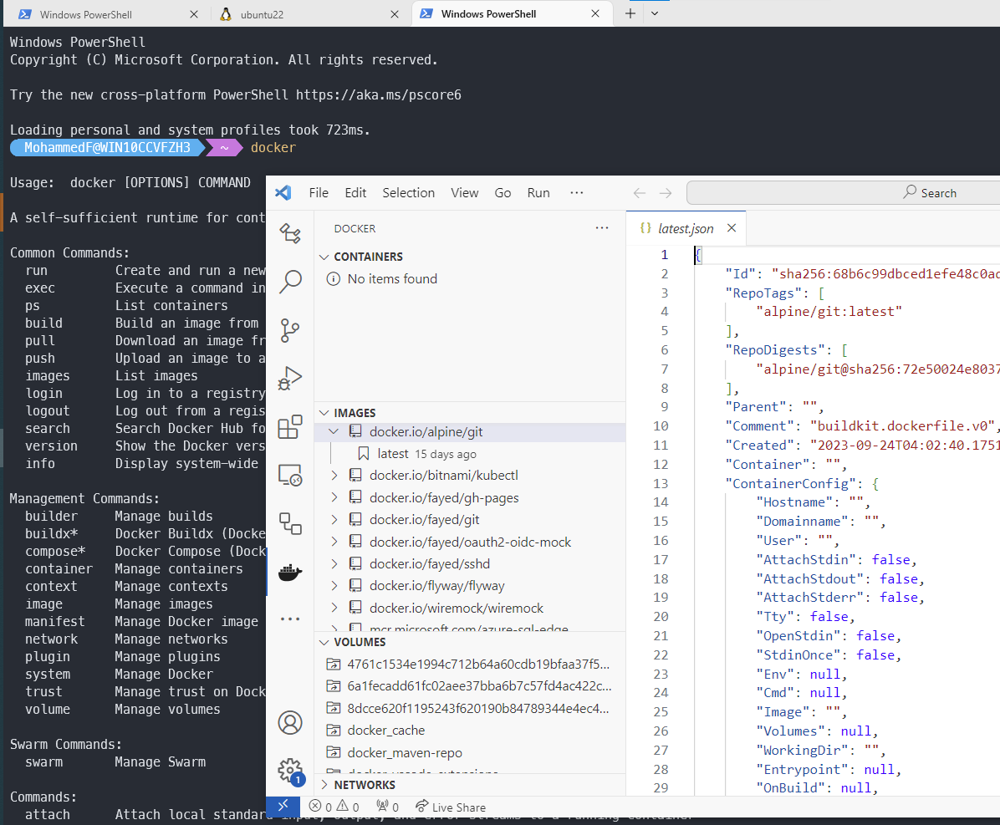

# Native Docker in WSL - even in a VM, No Docker Desktop





## Install WSL in a VM 

We need to Enable Nested VM (Powershel on the parent host machine)

```powershell
Set-VMProcessor -VMName "_FayedVM" -ExposeVirtualizationExtensions $true
```


How to locate the .vhdx file and disk path for your Linux distribution

```powershell
(Get-ChildItem -Path HKCU:\Software\Microsoft\Windows\CurrentVersion\Lxss | Where-Object { $_.GetValue("DistributionName") -eq '<DistributionName>' }).GetValue("BasePath") + "\ext4.vhdx"

# The result will display a path looking something like %LOCALAPPDATA%\Packages\<PackageFamilyName>\LocalState\<disk>.vhdx. For example:
# C:\Users\fayed\AppData\Local\Packages\CanonicalGroupLimited.Ubuntu_79rhkp1fndgsc\LocalState\ext4.vhdx
```

How to expand the size of your WSL 2 Virtual Hard Disk: [https://learn.microsoft.com/en-us/windows/wsl/disk-space](https://learn.microsoft.com/en-us/windows/wsl/disk-space)

---

## Steps to install Docker in WSL

Longin as root, to avoid using `sudo` many times

```shell
sudo -i
apt update && apt upgrade
```

if you faced DNS connectrviy issue:

```shell
echo -e "[network]\ngenerateResolvConf = false" | tee -a /etc/wsl.conf
unlink /etc/resolv.conf
echo nameserver 1.1.1.1 | tee /etc/resolv.conf
```

remove old versions:

```shell
apt remove docker docker-engine docker.io containerd runc
```

Install dependencies

```shell
apt install --no-install-recommends apt-transport-https ca-certificates curl gnupg2 -y
```
	

switch to legacy iptables

```shell
update-alternatives --config iptables
# And select [ iptables-legacy ]
```
		
Ubuntu package repository configuration

```shell
cat /etc/os-release

# note the ID (ubuntu in my case) and VERSION_CODENAME (jammy in my case) and use them in the bellow lines:

curl -fsSL https://download.docker.com/linux/ubuntu/gpg | tee /etc/apt/trusted.gpg.d/docker.asc
echo "deb [arch=amd64] https://download.docker.com/linux/ubuntu jammy stable" | tee /etc/apt/sources.list.d/docker.list
apt update
```

Install Docker

```shell
apt install docker-ce docker-ce-cli containerd.io -y
```

update docker-compose to latest version ( https://github.com/docker/compose/releases/)

```shell
curl -L "https://github.com/docker/compose/releases/download/v2.22.0/docker-compose-$(uname -s)-$(uname -m)" -o /usr/local/bin/docker-compose

chmod +x /usr/local/bin/docker-compose
docker-compose --version
```	

Create non-root-user, create home directory, and set default shell to bash (you can change it later with `chsh` command):

```shell
useradd -m -s /bin/bash [UserName]
```

set password and add the user to `sudo` and `docker` groups:

```shell
passwd [UserName]
usermod -aG sudo [UserName]
usermod -aG docker [UserName]
```
	
Passwordless launch of dockerd:

```shell
su [UserName]
echo "`whoami` ALL=(ALL) NOPASSWD:ALL" | sudo tee /etc/sudoers.d/`whoami` && sudo chmod 0440 /etc/sudoers.d/`whoami`
```


Test
```shell
docker run --rm hello-world
```

Auto Start Docker:

```shell
echo 'sudo service docker start' >> ~/.profile
	
# OR:

echo '# Start Docker daemon automatically when logging in if not running.' >> ~/.bashrc
echo 'RUNNING=`ps aux | grep dockerd | grep -v grep`' >> ~/.bashrc
echo 'if [ -z "$RUNNING" ]; then' >> ~/.bashrc
echo '    sudo dockerd > /dev/null 2>&1 &' >> ~/.bashrc
echo '    disown' >> ~/.bashrc
echo 'fi' >> ~/.bashrc
```

---

change the WSL default login user, replace `USER_NAME` with the desired user name:

```shell
echo -e "[user]\ndefault=USER_NAME" >> /etc/wsl.conf
```

---

## Call WSL executable from Windows

if you named this file `dig.bat` it will call the `dig` command from Linux in your WSL

```shell
@echo off
SETLOCAL EnableExtensions
SETLOCAL DisableDelayedExpansion
set v_params=%*
set v_params=%v_params:\=/%
set v_params=%v_params:c:=/mnt/c%
set DOCKER_DISTRO=Ubuntu
C:\Windows\system32\wsl.exe -d %DOCKER_DISTRO% %~n0 %v_params%
```


### Calling Docker from Windows PowerShell ;)

Open your PowerShell profile:
```powershell
notepad $profile

# %USERPROFILE%\Documents\WindowsPowerShell\Microsoft.PowerShell_profile.ps1
```

Then Add the following:

```powershell
$DOCKER_DISTRO = "Ubuntu"
function docker {
    wsl -d $DOCKER_DISTRO docker @Args
}
function docker-compose {
    wsl -d $DOCKER_DISTRO docker-compose @Args
}
```

### Calling Docker from Windows Command Prompt

create 2 batch files `docker.bat`, `docker-compose.bat` and add them to any location included in your `%PATH%`

for `docker.bat`, add the following:

```shell
@echo off
set DOCKER_DISTRO=Ubuntu
wsl -d %DOCKER_DISTRO% docker %*
```

for `docker-compose.bat`, add the following:
```shell
@echo off
set DOCKER_DISTRO=Ubuntu
wsl -d %DOCKER_DISTRO% docker-compose %*
```
	
---

## VSCode Docker extention

Although the above solutions works well from Windows PowerShell and Commmand Prombet, they don't work the VS Code Docker Extenstion but there is a solution ;)

`Downmload these shims for both Dokcer and Docker-Compose and add them to your path` [https://github.com/trakos/docker-wsl-shim](https://github.com/trakos/docker-wsl-shim)

## VSCode DevContainer

the solution that worked for me is to open my code folder from WSL, then open in DevContainer `(better to have your code in a native Linux path like /code/.. rather than a mounted Windows path like /mnt/c/...)`


---
sources:

- https://learn.microsoft.com/en-us/windows/wsl/disk-space#how-to-locate-the-vhdx-file-and-disk-path-for-your-linux-distribution
- https://learn.microsoft.com/en-us/windows/wsl/use-custom-distro
- https://dev.to/bowmanjd/install-docker-on-windows-wsl-without-docker-desktop-34m9
- https://gist.github.com/diablodale/54756043c395d712053cf0d50a86086a


